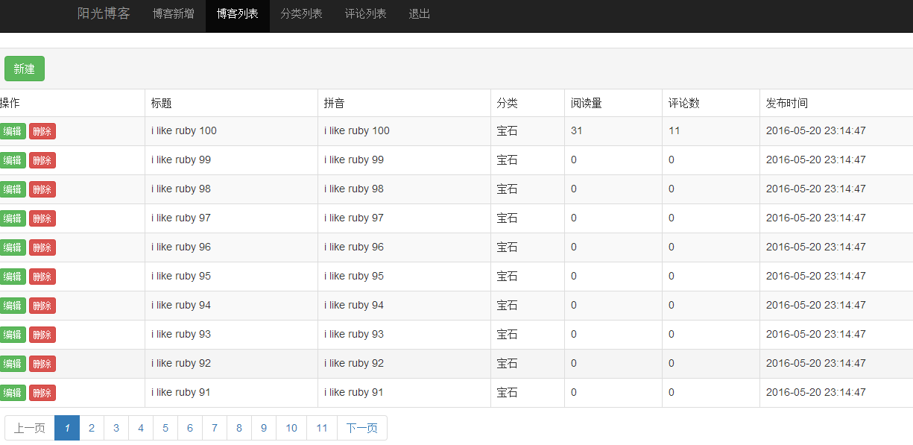
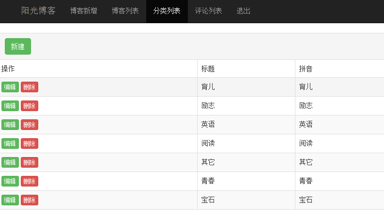
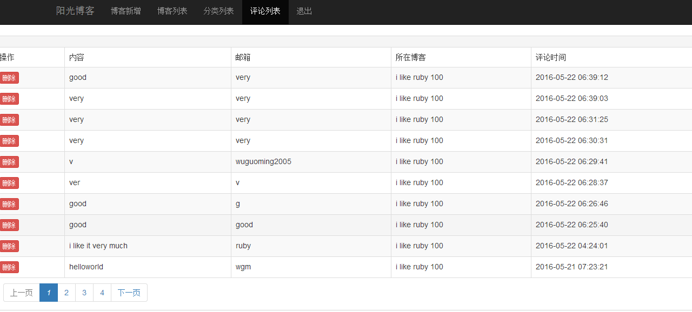

# description  
this is markdown blog  
support markdown when post a blog  
support two language:english and chinese  
support two type of database:sqlite3 and mysql  
support android,iphone,ipad,pc using the same programming   

# technology using  
ruby 1.8.7  
rails 3.0.8  
jquery 1.5.1  
bootstrap 3.3.5  
git source control  
sqlite3 and mysql  

# require gem except rails  
gem 'jquery-rails','1.0'  
gem 'will_paginate','>=3.0.pre'  
gem 'kramdown','1.11.1'  
gem 'dynamic_form','1.1.4'  

# functions  
foregroup:  
 blog list all  
 blog detail  
 blog list by category  
 post a comment  
backgroup:  
 auth(login,logout)  
 category manager  
 blog manager  
 comment manager  

# some snapshot  
## access on pc  
  
  
  
## access on mobile  
  
  
## backgroup  
  
  
  

# todo  
@jquery problem:the rails.js does not correspond to jquery  
@add will_paginage  
@the style of the validation message  
@cat-manager  
cat-can't delete when has blogs  
cat-convert the cat_name to cat_name_en  
@user-manager  
@user-login  
@user-logout  
user-login-stop the account when fail to login for 5 times  
user-login-retain the user_name where fail to login  
@blog-add a blog  
@blog-list all blog  
@blog-markdown  
@blog-index  
blog-index-by cat  
@blog-detail  
@blog-detail-leave a comment  
@comment-manager  
@i18n-the message in view  
@i18n-the message in controller  
@i18n-the message of model's attribute  
@i18n-validate message  
@i18n-the message of paging  
@i18n-the formate of datetime  
@test-units test  
@test-functional test  
test-integral test  
