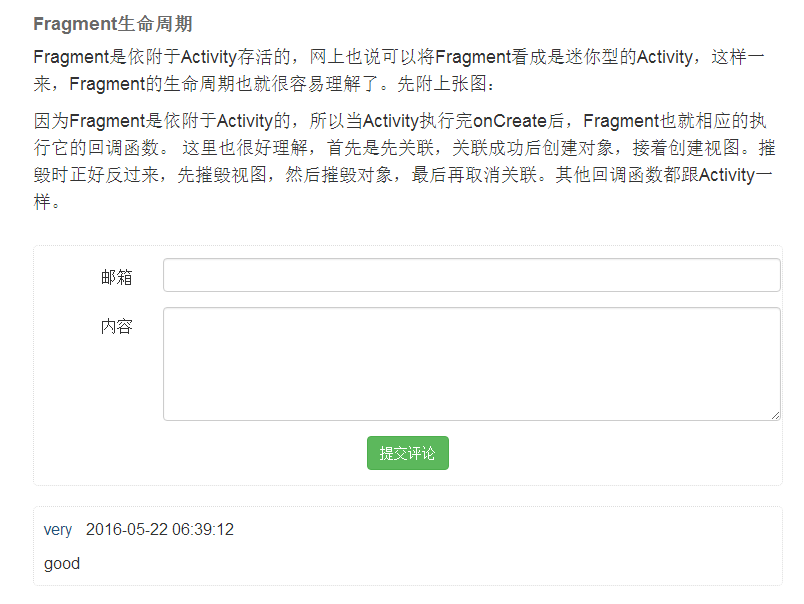

# description
this is markdown blog
support markdown when post a blog
support two language:english and chinese
support two type of database:sqlite3 and mysql
support android,iphone,ipad,pc using the same programming 

# technology using
ruby 1.8.7
rails 3.0.8
jquery 1.5.1
bootstrap 3.3.5
git source control
sqlite3 and mysql

# require gem except rails
gem 'jquery-rails','1.0'
gem 'will_paginate','>=3.0.pre'
gem 'kramdown','1.11.1'
gem 'dynamic_form','1.1.4'

# functions
foregroup:
 blog list all
 blog detail
 blog list by category
 post a comment
backgroup:
 auth(login,logout)
 category manager
 blog manager
 comment manager

# some snapshot
## access on pc

## access on mobile

## backgroup

# todo
¡Ìjquery problem:the rails.js does not correspond to jquery
¡Ìadd will_paginage
¡Ìthe style of the validation message
¡Ìcat-manager
cat-can't delete when has blogs
cat-convert the cat_name to cat_name_en
¡Ìuser-manager
¡Ìuser-login
¡Ìuser-logout
user-login-stop the account when fail to login for 5 times
user-login-retain the user_name where fail to login
¡Ìblog-add a blog
¡Ìblog-list all blog
¡Ìblog-markdown
¡Ìblog-index
blog-index-by cat
¡Ìblog-detail
¡Ìblog-detail-leave a comment
¡Ìcomment-manager
¡Ìi18n-the message in view
¡Ìi18n-the message in controller
¡Ìi18n-the message of model's attribute
¡Ìi18n-validate message
¡Ìi18n-the message of paging
¡Ìi18n-the formate of datetime
¡Ìtest-units test
¡Ìtest-functional test
test-integral test
